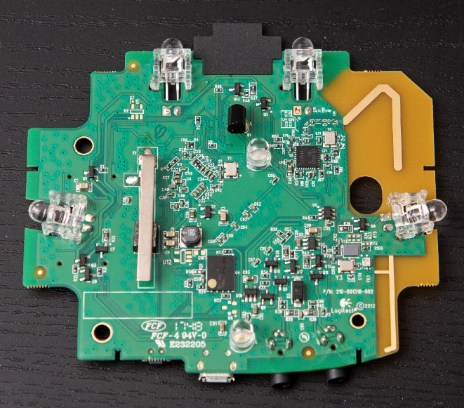
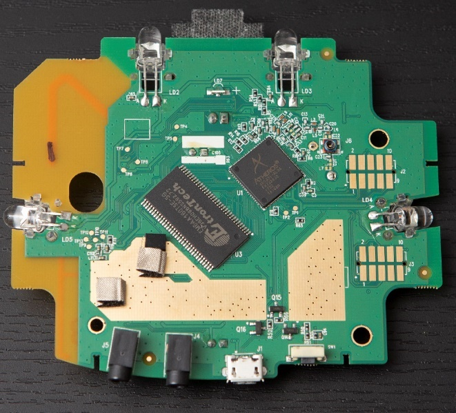
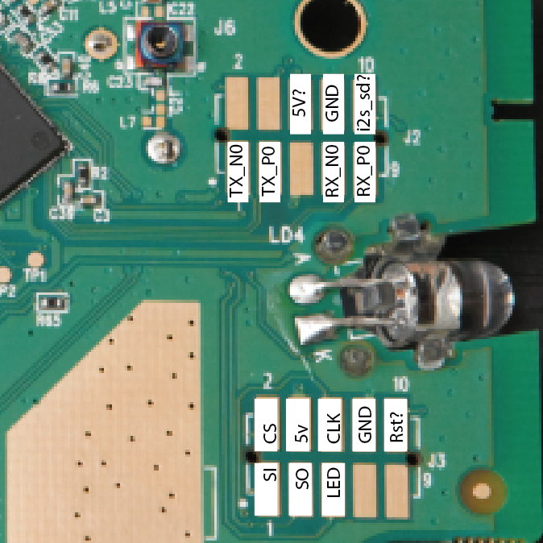
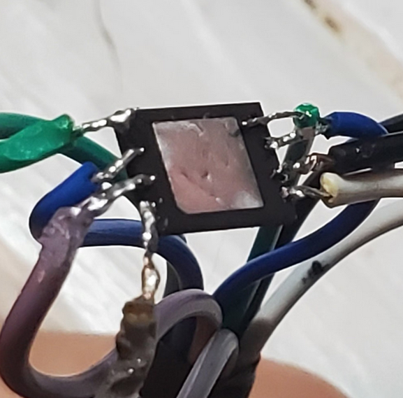

# Extracting the Frimware from a Logitech Harmony Hub
IoT - the "Internet of Things" - exemplifies the quintessential silicon valley axiom that everything is better when connected together. To enable the dream of the smart home which has captivated people <a href="https://en.wikipedia.org/wiki/Walt_Disney's_Carousel_of_Progress">since the space race</a>, device manufacturers have discovered that they can leverage the Internet to separate the three concerns of devices: user input, data processing, and output generation. A command received in a smart speaker can be interpreted by a server which then instructs a light to turn on.

While some devices such as smart speakers are only feasible because of the Internet, others have connectivity as a cheap gimmick... nobody asked for an Internet-connected <a href="https://www.amazon.com/AmazonBasics-Microwave-Small-Works-Alexa/dp/B07894S727">microwave</a>, <a href="https://www.troyhunt.com/data-from-connected-cloudpets-teddy-bears-leaked-and-ransomed-exposing-kids-voice-messages/">teddy bear</a>, or <a href="https://www.firstresponse.com/en-CA/Products/Pregnancy/Pregnancy-PRO">pregnancy test</a>. A concerning trend has emerged lately as companies leverage connectivity as a way to entangle products with services. When people think they are purchasing a surveillance camera what they end up purchasing is an "edge device" to a cloud service with an associated monthly fee.

Regardless of the motivation, the result is that the relationship between the manufacturer and the customer remains long after the purchase of a device is made. This can have some benefits like automatic firmware updates (that add functionality or patch vulnerabilities) but also some drawback like... automatic firmware updates (that remove functionality or even <a href="https://9to5google.com/2019/10/24/google-home-firmware-brick/">brick your device</a>). Also, the fate of your device is now tied to the fate of its company. So if the company is shut down or "pivots," <a href="https://www.theguardian.com/technology/2016/apr/05/revolv-devices-bricked-google-nest-smart-home">your</a> <a href="https://hackaday.com/2019/03/08/uncertain-future-of-orphaned-jibo-robots-presents-opportunities/">device</a> <a href="https://www.pocket-lint.com/gadgets/news/147897-rip-anki-toy-robot-company-abruptly-shuts-down-because-it-ran-out-of-money">will</a> <a href="https://www.engadget.com/2020-01-11-spectrums-exit-from-home-security-leaves-people-with-useless-te.html">be</a> <a href="https://consumerist.com/2016/08/19/tcp-disconnects-smart-lightbulb-servers-leaves-buyers-in-the-dark/index.html">useless</a>.

Which leads us where we are today. The firmware of a device stores the instructions for how the device operates and typically comprises a simplified version of the Linux operating system. If we are able to modify the firmware of a device, then we can reprogram it to function without the control and supervision of the manufacturer. This can have security and privacy benefits and can serve as a means to extend the life of a product.

<a href="https://www.asuswrt-merlin.net/">Some devices</a> make the process of loading alternative firmware so simple one might assume they want the user to do it: you click an "upload firmware" option. Others make it extremely difficult, whether to secure the device from adversaries or to prevent the consumer from using the device contrary to manufacturer intent (e.g., a video-game console running pirated games).

The device of interest at the moment is a <strong><a href="https://www.logitech.com/en-us/products/harmony/harmony-hub.915-000238.html">Logitech Harmony Hub</a></strong>. It is a handy device that includes IR blasters, a Bluetooth radio, and WiFi connectivity enabling you to turn on your IR home theater devices with a touch of a button. The problem is the interface is janky and it requires a cloud connection to work. I would like to modify the firmware so that it can run based on local (LAN) communications.

The first step for loading modified firmware is to get a copy of the original firmware. This is what I have done here. As expertly <a href="https://www.youtube.com/watch?v=oY-MxtJLEos">explained by Make Me Hack</a>, the techniques for getting the firmware, ranked from easiest to hardest, are:

<ol><li>Download from the manufacturer's website</li><li>Download from other sites on the internet - perhaps someone has already done the work for you</li><li>"Sniff" the firmware as the device downloads it from the internet as part of an update procedure</li><li>Connect to a debugging port on the device (e.g., JTAG) and download it from the processor</li><li>Connect to the EEPROM (i.e., firmware/flash chip) directly</li></ol>

A quick search reveals that the firmware is not to be found in the wild. Further, the update procedure is dictated by the device and there does not seem to be a way to force an update if the device is already up to date. I also tried plugging the USB connector it uses for power into my computer. While my computer did register that something was plugged in, I could not get any communication to the device. This means I will have to get out my screwdriver and start operating. Fortunately, iFixit <a href="https://www.ifixit.com/Teardown/Logitech+Harmony+Hub+Teardown/67576">blazed this trail</a> before and I can follow their steps which were about as complicated as opening up a box of cereal.

The first step is to expose the logic board by removing the plastic covering.

<figure class="wp-block-image size-large"><figcaption>This is the top of the board, the chip in the lower middle is the EEPROM where the firmware is loaded from at boot.</figcaption></figure>

<figure class="wp-block-image size-large"><figcaption>This is the underside of the board. The square chip is the CPU, the rectangular chip is the RAM and the pads on the right are for debugging.</figcaption></figure>

After removing the case, I starting following traces and doing continuity testing from the pads to pins of the CPU and firmware. After some sleuthing I have determined the following pin-outs for the pads:

<figure class="wp-block-image size-large"></figure>

The top pads are for debugging the CPU and appear to rely upon the networking functionality of the chip (TX_N0, TX_P0, RX_N0, RX_P0 are twister pair Ethernet hookups). The bottom pads are for the firmware chip that we are interested in and utilize the <a href="https://en.wikipedia.org/wiki/Serial_Peripheral_Interface">SPI</a> protocol.

I soldered wires to the bottom pads, connected them to my Raspberry Pi, SSH'ed into the Pi, enabled the SPI interface, and ran this basic SPI Python script using the spi_dev library:

    import spidev

    MODE_ID = 0x9f

    spi = spidev.SpiDev(0, 0) # create spi object connecting to /dev/spidev0.0
    spi.bits_per_word = 8
    spi.mode = 0b00 # device supports mode 1 and 3
    spi.max_speed_hz = 25000000 # set speed to 25MHZ

    # Tell the firmware to spit back its ID information
    spi.writebytes(&#91;MODE_ID])
    # Read the next identification information and print to console
    print(spi.readbytes(3))

I look to the console and see:

    [0,0,0]

Which definitely was not the chip manufacturer and device manufacturer IDs. I then spent the rest of the day debugging the SPI connection. I tried the SPI library in the c language to similar effect. Perhaps my soldering was bad so I redid all of the connections. No difference. I then began to wonder if I was implementing the library incorrectly so I did a loopback test. It worked. Maybe I can't trust it, so I set up a test connection between the Pi and an Arduino I had lying around. It worked as well.

I then realized that the Pi likely was having a hard time driving the lines because they were not only connected to the firmware chip, but other components on the board as well. I had discounted this because I was able to find a test point on the board that seemed to only power the firmware chip. I figured I was only powering the firmware and other components like the CPU would be effectively disabled. Without an oscilloscope I couldn't test for certain, but my ammeter did read lower voltages than expected: around 2.8V which is barely within the 3.3V+/-0.5 spec of the chip. To account for this I created a voltage divider and drove the chip with another voltage source - getting closer to the 3.3V target for VCC.

This still did not get the SPI connection working. I remembered that the Arduino had 5V GPIO so maybe it would be able to power through other components and get a strong signal to the firmware chip. Obviously, overdriving a signal can be dumb and brick your component, but I was getting desperate. I quickly wrote an SPI script in the Arduino sketch language using the spi.h library (this is my third programming language for the SPI connection) and still nothing.

As I was going to throw in the towel and accept defeat, I decided to go beyond my comfort level and remove the chip from the board. I got my heat gun and applied a steady amount of heat until I unseated the chip rather cleanly.

<figure class="wp-block-image size-large"><figcaption>The chip has been removed! A capacitor and a transistor went with it while a resister wiggled out of place, but hopefully it can be fixed ample application of flux</figcaption></figure>

I then as able to solder the SPI wires to the chip and connect it to the Raspberry Pi.

<figure class="wp-block-image size-large"></figure>

Success! I was able to read data from the firmware chip. The device ID information matched the datasheet and everything was working flawlessly. I then wrote the following script to load the byte data onto the Pi:

    import spidev
    import sys

    MODE_ID = 0x9f
    MODE_READ = 0x03
    MODE_STATUS = 0x05

    outfile = open("firmware.bin", "wb")

    spi = spidev.SpiDev(0, 0) # create spi object connecting to /dev/spidev0.0
    spi.bits_per_word = 8
    spi.mode = 0b00
    spi.max_speed_hz = 25000000 # set speed to 25MHZ

    # Tell it to go into read mode starting at address 00 00 00
    spi.writebytes(&#91;MODE_READ,0,0,0])

    # Read block of 128 bytes (2**7) and then write to disk, going through the entire
    # address space
    addressBits = 24
    blockSize = 7
    totalBlocks = 2**(addressBits-blockSize)

    for byteCounter in range(totalBlocks):
        
        # The firmware will continue to provide bytes in sucessive addresses until
        # the CS line is raised to end the connection
        inBytes = bytes(spi.readbytes(2**blockSize))

        # Status bar. This should take a little bit to go through all 16MB
        percentComplete = int(100*byteCounter/totalBlocks)
        sys.stdout.write('#' * percentComplete + '-' * (100 - percentComplete) + '\n')
        sys.stdout.write(str(inBytes&#91;0])+'\r\033&#91;A')
        sys.stdout.flush()

        # Write the bytes to file
        outfile.write(inBytes)

    print("\n\n")
    spi.close()

With the firmware extracted, I used <a href="http://binvis.io">binvis.io</a> to generate a picture of the firmware. It provided this nice graphic:

<figure class="wp-block-image size-large is-resized"></figure>

While the large blocks of empty data were somewhat concerning, I believe this has to do with the way data is cleared from memory and likely would not be a problem.

I then installed <a href="https://www.refirmlabs.com/binwalk/">binwalk</a> to review the firmware and extract it. The firmware had the following structure:

    DECIMAL       HEXADECIMAL     DESCRIPTION
    --------------------------------------------------------------------------------
    14016         0x36C0          U-Boot version string, "U-Boot 1.1.4-g4fe3722 (Aug 17 2016 - 16:40:41)"
    14064         0x36F0          CRC32 polynomial table, big endian
    15356         0x3BFC          uImage header, header size: 64 bytes, header CRC: 0x59A230C6, created: 2016-08-17 11:10:43, image size: 39609 bytes, Data Address: 0x80010000, Entry Point: 0x80010000, data CRC: 0x3E861FB5, OS: Linux, CPU: MIPS, image type: Firmware Image, compression type: lzma, image name: "u-boot image"
    15420         0x3C3C          LZMA compressed data, properties: 0x5D, dictionary size: 8388608 bytes, uncompressed size: 109716 bytes
    65536         0x10000         uImage header, header size: 64 bytes, header CRC: 0x6A1A780C, created: 2020-09-11 05:38:45, image size: 951044 bytes, Data Address: 0x80002000, Entry Point: 0x801CB980, data CRC: 0x61443826, OS: Linux, CPU: MIPS, image type: OS Kernel Image, compression type: lzma, image name: "Pimento Kernel Image"
    65600         0x10040         LZMA compressed data, properties: 0x5D, dictionary size: 8388608 bytes, uncompressed size: 2671104 bytes
    1048576       0x100000        uImage header, header size: 64 bytes, header CRC: 0x2DAD2DE0, created: 2016-08-17 11:11:16, image size: 950961 bytes, Data Address: 0x80002000, Entry Point: 0x801CB980, data CRC: 0x6E0601DB, OS: Linux, CPU: MIPS, image type: OS Kernel Image, compression type: lzma, image name: "Pimento Kernel Image"
    1048640       0x100040        LZMA compressed data, properties: 0x5D, dictionary size: 8388608 bytes, uncompressed size: 2671104 bytes
    2031616       0x1F0000        Squashfs filesystem, little endian, version 4.0, compression:lzma, size: 3649632 bytes, 654 inodes, blocksize: 131072 bytes, created: 2020-09-11 05:46:42

I then was able to tell binwalk to extract and decompress the firmware and now I have a copy of the firmware. Mission complete.
